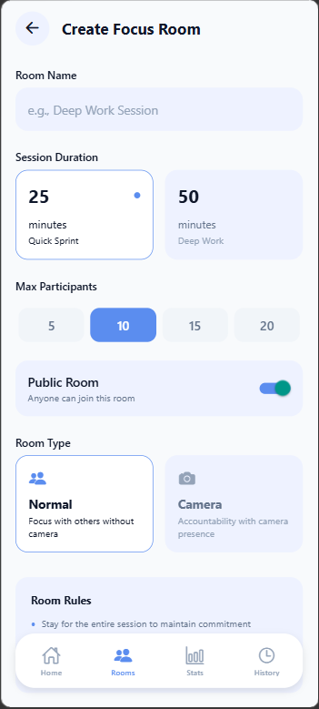
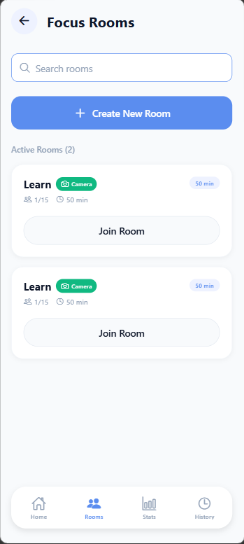
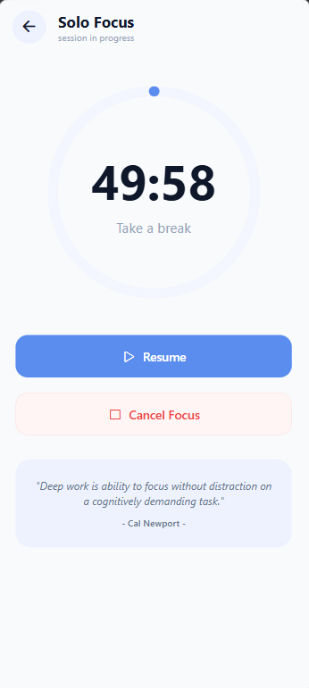
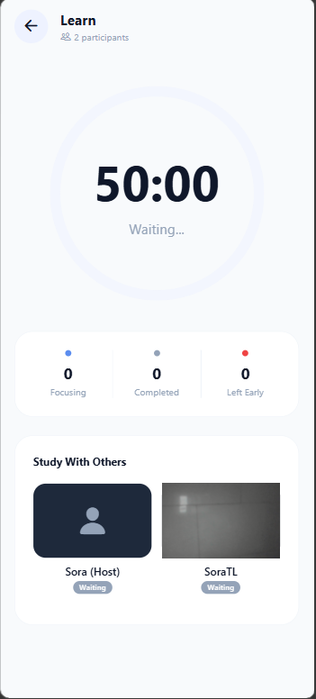
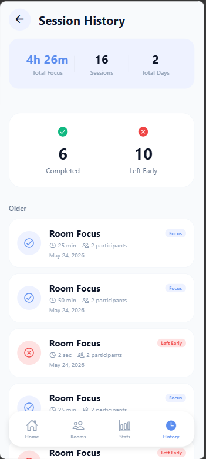

# Focus - Ứng dụng Tập Trung Cộng Đồng

## Giới thiệu
Chào mừng bạn đến với ứng dụng Focus - nền tảng tập trung cộng đồng giúp người dùng tạo và tham gia các phòng tập trung, kết nối với nhau và theo dõi tiến độ tập trung của mình. Mục tiêu chính của ứng dụng là tạo ra một môi trường tương tác, năng động để mọi người có thể cùng nhau tập trung và đạt được mục tiêu cá nhân.

## Tech Stack

### Frontend
- **React Native (Expo)**: Framework phát triển ứng dụng di động đa nền tảng
- **React Navigation**: Quản lý điều hướng trong ứng dụng
- **Expo Camera**: Quản lý camera và quyền truy cập camera
- **React Native Reanimated**: Xử lý animation mượt mà
- **React Native Chart Kit**: Hiển thị biểu đồ thống kê
- **Axios**: Gọi API và xử lý request

### Backend
- **Spring Boot**: Framework phát triển ứng dụng Java
- **Spring Security + JWT**: Xác thực và ủy quyền người dùng
- **Spring Data JPA**: Tương tác với cơ sở dữ liệu
- **Spring WebSocket**: Xử lý kết nối realtime
- **PostgreSQL**: Cơ sở dữ liệu quan hệ
- **Redis**: Lưu trữ cache và dữ liệu thời gian thực
- **Lombok**: Giảm boilerplate code

### Deployment
- **Docker**: Container hóa ứng dụng
- **Docker Compose**: Quản lý multi-container

## Tổng quan kiến trúc
Ứng dụng Focus được xây dựng với kiến trúc client-server, sử dụng WebSocket để đồng bộ dữ liệu realtime giữa các client và server.

## Dịch vụ chính

### 1. Frontend (React Native Expo)
- **Màn hình chính**: Hiển thị danh sách phòng và thông tin người dùng
- **Màn hình phòng tập trung**: Quản lý session tập trung, hiển thị camera, theo dõi thành viên
- **Màn hình thống kê**: Hiển thị biểu đồ và số liệu về thời gian tập trung
- **WebSocket Client**: Kết nối và nhận sự kiện realtime từ server

### 2. Backend (Spring Boot)
- **Auth Server**: Xác thực người dùng và phát hành token JWT
- **Resource Server**:
  - Quản lý phòng tập trung
  - Quản lý session tập trung
  - Quản lý thành viên phòng
  - Xử lý WebSocket cho các sự kiện realtime
  - Lưu trữ và thống kê dữ liệu

## Cơ chế chính

### Xác thực và Ủy quyền với JWT
- **Xác thực**: Người dùng đăng nhập và nhận token JWT từ Auth Server
- **Ủy quyền**: Frontend gửi token trong header của mỗi request đến Resource Server
- **JWT Filter**: Resource Server xác minh token và thiết lập Security Context

### Kết nối Realtime với WebSocket
- **Kết nối**: Client kết nối đến WebSocket endpoint với roomId và userId
- **Broadcast**: Server broadcast các sự kiện đến tất cả client trong phòng
- **Sự kiện**: USER_JOINED, USER_LEFT, SESSION_STARTED, SESSION_COMPLETED, HOST_CHANGED

## Đặc điểm

### 1. Tạo và Tham gia Phòng Tập Trung
- **Tạo phòng**: Người dùng có thể tạo phòng với các tùy chỉnh (thời gian, số lượng thành viên, loại phòng)
- **Tham gia phòng**: Tìm kiếm và tham gia các phòng công khai
- **Loại phòng**: Phòng thường và phòng Camera (yêu cầu quyền camera)

### 2. Session Tập Trung
- **Bắt đầu session**: Host của phòng bắt đầu session tập trung
- **Đếm ngược**: Hiển thị thời gian còn lại của session
- **Theo dõi thành viên**: Xem trạng thái của các thành viên trong phòng (Đang tập trung, Hoàn thành, Rời sớm)
- **Kết thúc session**: Host có thể kết thúc session trước thời hạn

### 3. Camera Room
- **Quyền camera**: Yêu cầu và quản lý quyền truy cập camera
- **Hiển thị camera**: Hiển thị camera của người dùng trong phòng Camera
- **Xem thành viên**: Xem camera và trạng thái của các thành viên khác

### 4. Thống kê và Biểu đồ
- **Tóm tắt**: Tổng thời gian tập trung, số ngày liên tiếp, số session, thời gian trung bình mỗi ngày
- **Biểu đồ tuần**: Hiển thị thời gian tập trung theo từng ngày trong tuần
- **Biểu đồ hàng ngày**: Hiển thị chi tiết thời gian tập trung hàng ngày
- **Thành tựu**: Hiển thị các thành tựu đạt được

### 5. Quản lý Host
- **Host mặc định**: Người tạo phòng là Host mặc định
- **Chuyển Host**: Nếu Host rời phòng, thành viên đầu tiên tham gia sẽ trở thành Host mới
- **Quyền Host**: Chỉ Host có thể bắt đầu/kết thúc session và chỉnh sửa cài đặt phòng
